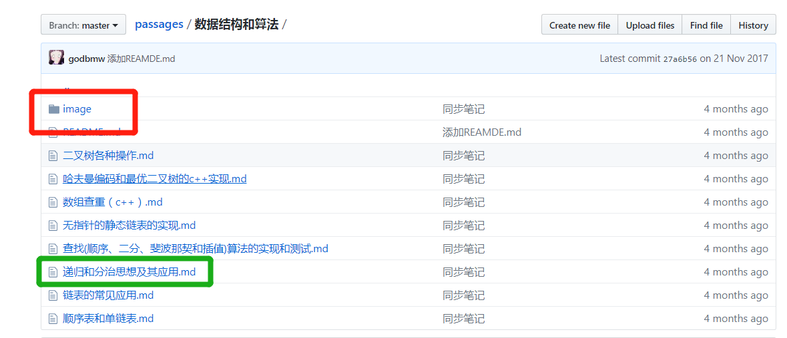
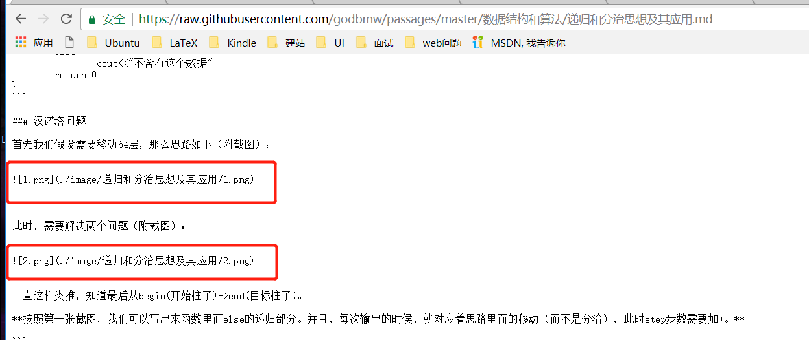

> 这是一个基于`Web`，跨多平台的**开源、非盈利**展示平台。[源码地址，欢迎`star`](https://github.com/godbmw/onebook)。


## 1. 你是谁？

这里欢迎：
- 程序猿/程序媛
- 技术布道者
- 网络作家/写手
- 图书出版商/作者/合伙人
- 普普通通的生活记录者
- ......


## 2. 能做什么？

> 概括来说，你可以**拥有自己独立的网址，然后向世界展示自己**。

- ~~用作博客：记录文字、记录自己~~
- ~~用作笔记：方便平时查看和使用~~
- ~~用作技术分享：向他人展示教程、踩坑记录~~
- ~~用作宣传：可以放一些图书的样章，甚至是全部图书~~

1. 装B：带有个人`github`账号的网址，随时扔给别人展示
2. 装B：平时整理得文章，足以彰显智慧
3. 装B：直接放网址，别人就能看到你的文章或图书样章或...也许哪天就出名了:)

## 3. 与众不同？

> **为什么要选择这个平台**？这里和[简书](https://www.jianshu.com/)、[CSDN](https://www.csdn.net/)、[新浪博客](http://blog.sina.com.cn/)、[HEXO等开源博客框架](https://hexo.io/)、[gitbook](https://www.gitbook.com/explore)等产品或者平台相比有何出彩之处？

### 3.1 基于`Github`

- 如果你是程序员，那么请跳过！
- 如果你不是程序员：简单来说，`github`是一个可以存放文本、图片，可以在线讨论，在线答疑的多功能平台。而且，**你可以查看每次的修改记录，你可以恢复误删的文件，你可以在地方下载你上传过的东西**。

[>>> 看：文科妹子如果使用Github（你也可以！）](https://www.zhihu.com/question/20070065/answer/79557687)

### 3.2 基于`Markdown`

- 如果你是程序员，那么请跳过！
- 如果你不是程序员：简单来说，它帮助你对文章进行排版,完全解放你的生产力，您只需要花费10-20分钟学习基本规则，你就可以**专注创造！**
- 如果你还不清楚他的用途，那么请去[中国最大的创作平台“简书”](https://www.jianshu.com/)或者[知乎评论系统](https://www.zhihu.com/)看一下。里面的文章大多是利用`Markdown`书写的。

[>>> 了解Markdown基本用法](https://www.zhihu.com/question/20409634)

[>>> 学习Markdown标准语法](https://www.appinn.com/markdown/)

### 3.3 专注展示，业务分离

这个平台目前只为你解析并且渲染基于`Markdown`语法的文章、笔记，这意味着：

- 你可以在你个人电脑、手机上根据自己的喜好**选择编辑器或者Markdown写作工具**。
- 你可以**系统地、完全地保有自己的文章、笔记**于本地、个人U盘、个人存储设备等。
- 你可以专注**写作、记录、整理、推广、布道**

### 3.4 与众不同，个人链接

每个人都有独自的网址，**方便展示和推广！**

## 4. 使用说明

> 如果不是程序员或者有着相关经验，那么，你可能需要花一些时间学习一下下面涉及的知识。相信信息时代的你，一定拥有不甘落后的精神和快速学习的能力。

### 4.1 关于`github`

欢迎去看看知乎上的文科妹子怎么使用`github`的。当你开始使用它，你会惊叹它奇妙。

对于这个平台，你只需要**一个账号**，**一或多个存放文章资源的仓库**，**学会如何上传**

[>>> 看：文科妹子如果使用Github（你也可以！）](https://www.zhihu.com/question/20070065/answer/79557687)

### 4.2 关于`Markdown`

目前主流的写作平台都支持`Markdown`（确实好用），他可以方便你排版，让你的**双手完全飞舞在键盘**（而不是在键盘和鼠标之间切换）。

除非你坚持使用笨重、老掉牙的`Markdown`编辑器，或者真的毫无学习能力。否则，你会喜欢上这种专注写作的工具。

[>>> 了解Markdown基本用法](https://www.zhihu.com/question/20409634)

[>>> 学习Markdown标准语法](https://www.appinn.com/markdown/)

### 4.3 仓库配置

- 在您的仓库的根目录下添加：`book.json`文件。
- 配置`book.json`
    - `summary`:必选项，这里是您要展示的文章目录
    - 文件夹（代表文章分类）需要使用`{}`格式
    - 文本文件（代表文章）：同一类下使用`[]`包裹。

来看一下一个简单的小例子，**在书写的时候请去掉 `// ...`，这里仅仅为了方便说明**。
```json
{
    "author":"DongYuanxin", // 可选项
    "summary":{ // 必选项
        "NodeJs":[ // 一级目录
            "module.exports和exports.md" // 千万不要忘记文件后缀名
        ],
        "JavaScript":{
            "函数":[ // 多级目录
                "原型链妙用.md", // 此分类下的文章列表
                "调用模式.md",
                "闭包.md",
                "级联.md"
            ],
            "ES6":[ // 多级目录
                "Promise理解.md",
                "let的单独作用域.md",
                "理解const的“不变”.md"
            ]
        },
        "python":{
            "高级应用":[
                "三神器-迭代器、生成器和装饰器.md"
            ]
        }
    }
}
```

**通过配置来清晰展示更合理的结构和分类，欢迎尝试和体验。**

[>>> 看看站长的`book.json`配置](https://github.com/godbmw/book/blob/master/book.json)


### 4.4 您自己的网址

在你将自己的文章上传到`Github`的仓库并且在仓库的路径下按照要求配置了`book.json`文件后，你就可以拥有自己的展示网址啦：

- `www.godbmw.com/book/github用户名`：将会获取指定用户名下的名为`book`仓库的`book.json`配置和相关文章。如果失败，将会重新进入`www.godbmw.com/book`页面。
- `www.godbmw.com/book/github用户名/仓库名`：将会自动获取指定用户名下的指定仓库的`book.json`配置和相关文章。如果失败，将会重新进入`www.godbmw.com/book`页面。
- `www.godbmw.com/book/github用户名/指定仓库?key=......`：用于分享，可以直接定位到您的指定文章。

### 4.5 关于`Markdown`里面插入图片链接
> 如果你的图片是利用**相对路径**插入（即：图片和文章放在一个仓库里），那么：**请在存放文章的文件夹下创建对应文件夹，并且将图片存入其中**。

1. 例如，你可以在存放文章的文件下建立`image`文件夹，如下图所示：


2. 在对应的文章里（例如上图标出的`递归和分治思想及其应用.md`），利用相对路径来索引图片。


3. 当然，放置图片的文件夹还可以命名为`images`、`photo`等。只要是在**存放文章的目录下**即可。

## 5. 更多问题

你可以直接进入[快速提交通道](https://github.com/godbmw/book/issues)，或者向`godbmw.com@gmail.com`发封email。

**如果你对这个项目有兴趣或者体验不错，那么欢迎[帮我点一个star](https://github.com/godbmw/onebook)。如果你想资助这个开源项目，欢迎通过`emial`联系我。**
